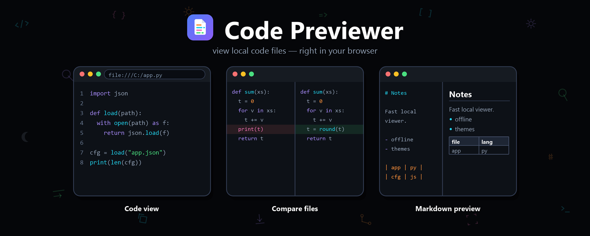
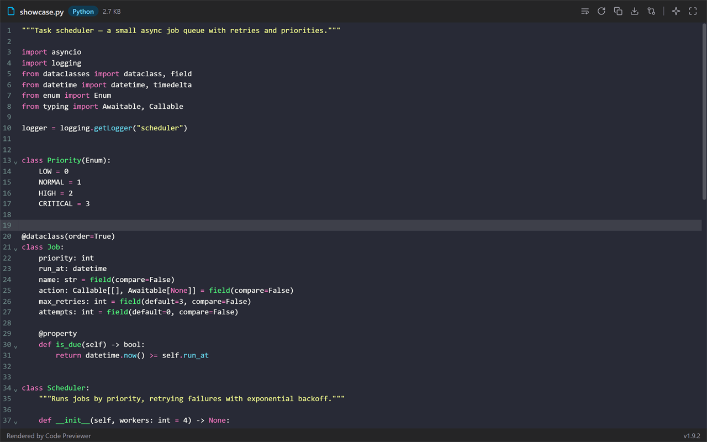
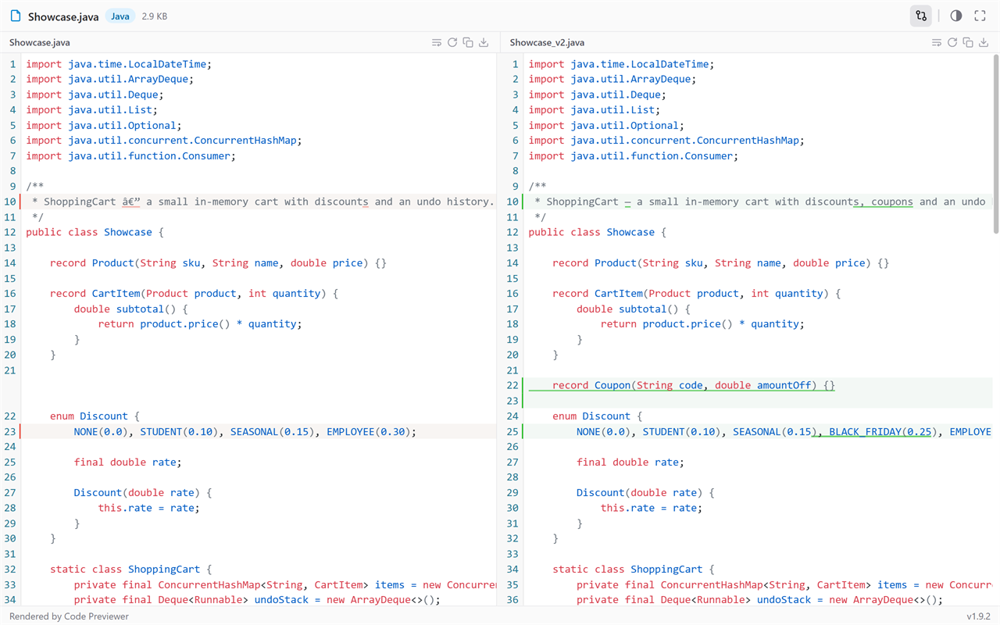
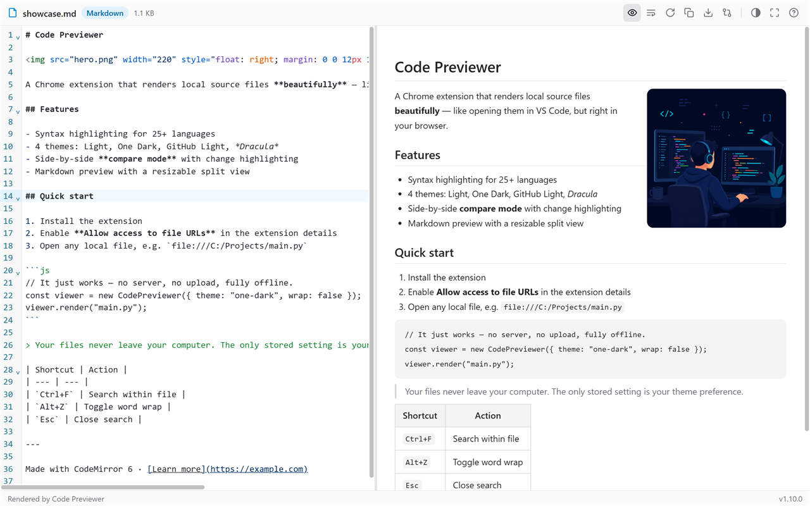
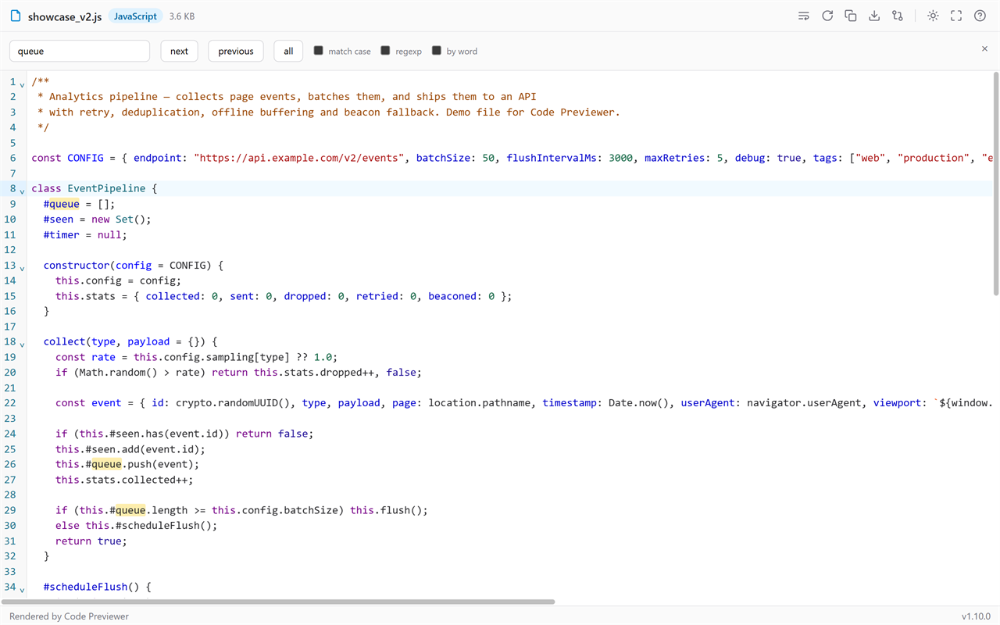
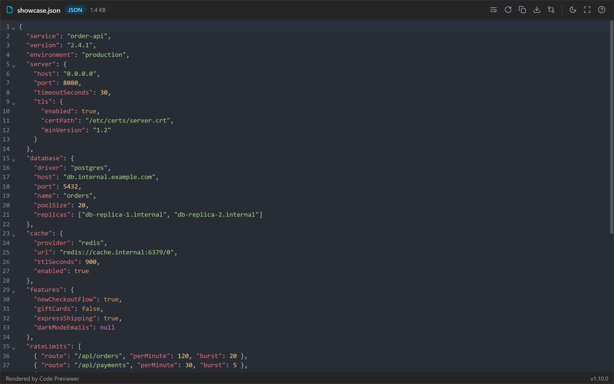

<div align="center">



<br><br>

**Open any local source file in your browser — rendered like VS Code.<br>No server. No upload. No internet. Just `file://` done right.**

<br>


<br>

[](#-store-listings)
&nbsp;&nbsp;&nbsp;
[](#-store-listings)

**🌐 [lalit-rajpurohit.github.io/Code-Previewer](https://lalit-rajpurohit.github.io/Code-Previewer/)**

<br><br>



</div>

<br>

## 📸 Screenshots

<div align="center">

| One Dark · Python | Compare mode · Java |
| :---: | :---: |
|  |  |

| Markdown preview | Search · JavaScript | Dracula · JSON |
| :---: | :---: | :---: |
|  |  |  |

</div>

## ⚡ `$ code-previewer --features`

```console
$ code-previewer --features

  ✓ syntax highlighting ....... 25+ languages, VS Code-grade colors
  ✓ themes .................... ☀ Light · 🌙 One Dark · ☁ GitHub Light · 🧛 Dracula
  ✓ compare mode .............. side-by-side diff of any two files
  ✓ markdown preview .......... live split view · draggable divider · tables
  ✓ search .................... Ctrl+F panel — regex, match case, by word
  ✓ editor extras ............. line numbers · code folding · word wrap
  ✓ file actions .............. copy · download · reload from disk · fullscreen
  ✓ privacy ................... zero network calls — files never leave your machine

$ _
```

## 🗂 Language support

```text
╭──────────────┬──────────────┬──────────────┬──────────────┬──────────────╮
│  Python      │  JavaScript  │  TypeScript  │  JSON        │  YAML        │
│  HTML        │  CSS         │  Java        │  Go          │  Rust        │
│  C / C++     │  SQL         │  XML / SVG   │  Markdown    │  Shell       │
│  Dockerfile  │  TOML        │  INI / .env  │  CSV / logs  │  + more...   │
╰──────────────┴──────────────┴──────────────┴──────────────┴──────────────╯
```

> Unknown-but-texty extensions fall back to a clean plain-text view — so *any* code file opens.

## 🎨 Themes

| | Theme | Vibe |
| :---: | --- | --- |
| ☀ | **Light** | clean default, easy on projectors |
| 🌙 | **One Dark** | the Atom classic |
| ☁ | **GitHub Light** | familiar PR-review feel |
| 🧛 | **Dracula** | because obviously |

One click cycles through all four — your pick is remembered across sessions.

## 📦 Install

```console
$ how-to-install

  [1] Get it from the Chrome Web Store or Edge Add-ons  ──▶  buttons above ☝
  [2] Extension Details → ✓ "Allow access to file URLs"     (one-time, required)
  [3] Open any local file:

      file:///C:/projects/main.py        ← boom. syntax highlighted.
```

## ⌨️ Shortcuts

| Keys | Action |
| --- | --- |
| <kbd>Ctrl</kbd> + <kbd>F</kbd> | Search within file |
| <kbd>Enter</kbd> / <kbd>Shift</kbd> + <kbd>Enter</kbd> | Next / previous match |
| <kbd>Alt</kbd> + <kbd>Z</kbd> | Toggle word wrap — in compare mode, only the pane your cursor is in |
| <kbd>Esc</kbd> | Close search panel |
| <kbd>▸</kbd> gutter click | Fold / unfold a code block |

## 🔒 Privacy

```diff
+ everything runs locally in your browser
+ the only stored setting is your theme preference
- no analytics
- no telemetry
- no network requests
- no accounts, ever
```

## 🧭 Roadmap

- [x] Syntax highlighting — 25+ languages
- [x] 4 themes with persistence
- [x] Side-by-side compare mode with per-pane word wrap
- [x] Markdown preview with resizable split & tables
- [x] Search, folding, copy, download, reload, fullscreen
- [ ] 🚧 Chrome Web Store listing — **in review**
- [ ] 🚧 Edge Add-ons listing — **in review**
- [ ] Minimap
- [ ] More themes

## 🚧 Store listings

> **Coming soon!** ⏳ The extension is currently **in review** on the **Chrome Web Store** and **Microsoft Edge Add-ons**. The buttons at the top go live the moment review completes — watch this repo to get notified.

<br>

---

<div align="center">

**If this looks useful, drop a ⭐ — it genuinely helps.**

<sub>`Rendered by Code Previewer` · MIT License · <a href="https://lalit-rajpurohit.github.io/Code-Previewer/">live site</a></sub>

</div>
